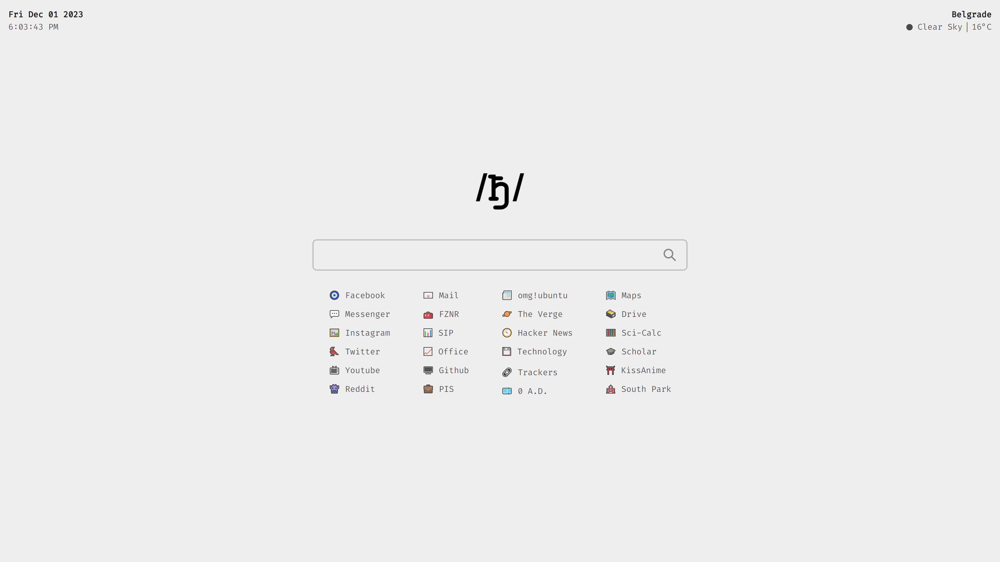

personal-homepage-v2
=================

### Live Demo: <a href="https://djordjeivanovic9.github.io/personal-homepage-v2/">link</a>

### Default Home

This is a simple start page inspired by Tressley's [startpage](https://github.com/tressley/_traichu).\
A few changes include new icons for bookmarks, changed location and temperature format (from fahrenheit to celsius).

## Credits
Tressley's Github page [link](https://github.com/tressley/_traichu). \
Images used for bookmarks are by Emojipedia's [website](https://emojipedia.org/).\
Search bar is powered by DuckDuckGo [quack](https://duckduckgo.com/). 

## How to change location?
This is explanation according to Tressley. \
You will need to generate your own OpenWeather API key.
1. Register for an OpenWeather account [here](https://home.openweathermap.org/users/sign_up) (OpenWeather will generate a default API key).
2. Sign in and navigate to *Username* > *API keys* and copy the key.
3. Paste the key into **line 10** of **main.js** file.

## How to update data for your city?
1. Find your city using OpenWeather's search [here](https://openweathermap.org/find).
2. Copy the city ID from the end of the URL.\
E.g. openweathermap.org/city/**random_number**  🠆  **random number**
3. Paste the city ID (random number) into **line 26** of **main.js** file.

**Note:** All elements that can be changed will be clearly marked (commented) in the files mentioned above.
